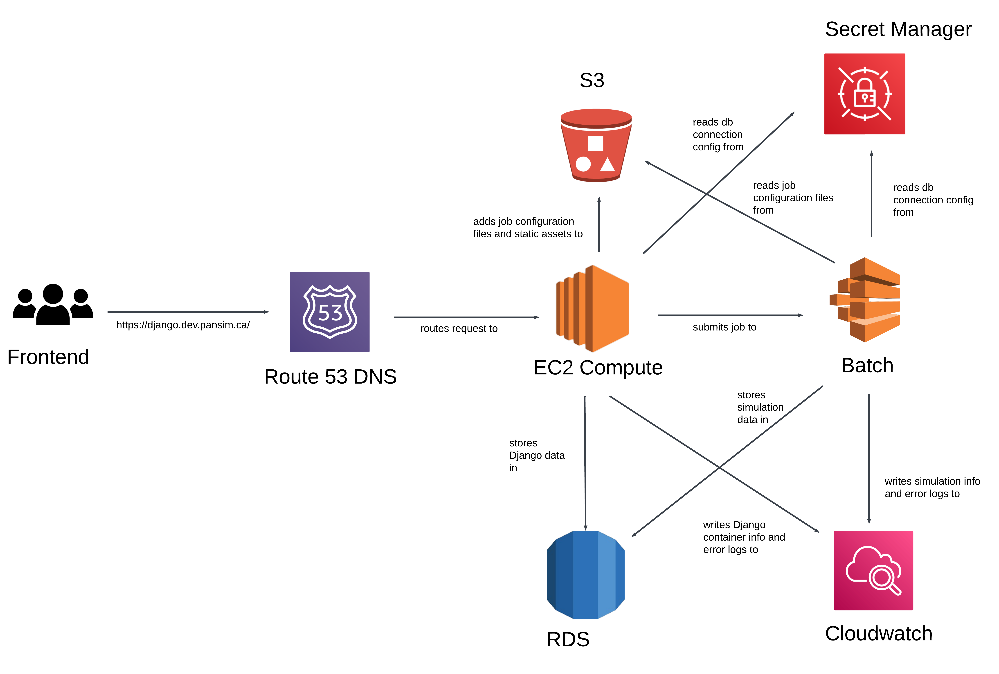

# PanSim


# Setup 
Visit the [PanSim GitHub Organization](https://github.com/pansim-org). Most development can be done by only cloning the [morpop-django](https://github.com/pansim-org/morpop-django) repository.

First clone the repository and cd into it.
```sh
git clone https://github.com/pansim-org/morpop-django.git
cd morpop-django
```

## AWS 
1. Install the [AWS CLI](https://docs.aws.amazon.com/cli/latest/userguide/getting-started-install.html).
2. Get your CLI credentials from [AWS IAM](https://us-east-1.console.aws.amazon.com/iam/home?region=ca-central-1#/users).
   - The clients (likely Nojan) will have to provide you with IAM credentials before you can perform this step.
   - The process of getting your CLI credentials is as follows:
     - Click `users`.
     - Select your username.
     - Click `security credentials`
     - Create an access key for CLI.
3. Go to your terminal and run `aws configure` and provide the region of `ca-central-1`.
4. Run `aws s3 ls` to verify your CLI credentials.


## Django
There are 2 simple scripts you can run.
```sh
# To set up your environment (you only need to do this once; but migrate the databse again if you make changes to the models): 
sh startup.sh

# To run the backend:
sh run.sh
```

## Testing during Development
Here are several ways you can test during development.

### Postman
We have a [public Postman workspace] you may reach out to gain access. You may fork the workspace into [Postman on your machine](https://www.postman.com/downloads/) to continue building off of it (since requests cannot be made in public workspaces).

Note that 
- The `{{domain}}` environment variable can be set to `django.dev.pansim.ca` (deployed backend) or `localhost:8000` (local backend).
- You may find the [pre-request script](https://www.postman.com/warped-firefly-880683/workspace/csc301-d2/request/15150521-ff6a148a-8a28-4016-9317-57fcba9dab8e?tab=tests) from a Postman workspace of one of our subteam's deliverable 2 and [an example usage of this pre-request script](https://www.postman.com/warped-firefly-880683/workspace/csc301-d2/request/15150521-37db731b-d1dd-430c-83df-3f9017b6bb24?tab=headers) helpful.
  - This is mainly to avoid copying bearer tokens when testing.
  - These functionalities are not set up in the first public workspace.
 

### Local Database
In production, the backend uses AWS RDS. However, we recommend setting up a local database for testing purposes since a firewall is set up on RDS which makes it harder to test with. As such we recommend creating a test database or using a database like [mysql](https://dev.mysql.com/downloads/installer/) for local testing purposes.

Steps for setting up a mysql database using docker:

1. Install [docker](https://docs.docker.com/engine/install/)
2. Run `docker --version`
3. Run `docker pull mysql:latest`
4. Choose a password and run `docker run --name mysql-pansim -e MYSQL_ROOT_PASSWORD=<your_root_password> -e MYSQL_DATABASE=pansim_db -p 3306:3306 -d mysql:latest`
5. Run `docker ps` to verify that the container is running
6. Run `docker exec -it mysql-pansim mysql -u root -p`
7. Enter the root password you chose in step 4

to stop the container run `docker stop mysql-pansim`
to start the container again run `docker start mysql-pansim`
to connect to the database run `docker exec -it mysql-pansim mysql -u root -p`
to remove the container run `docker rm mysql-pansim`


If you are using a test database, it is a **requirement to create and populate an `.env` file** (which should not be pushed to GitHub for security reasons).

```shell
cd morpop-django
touch .env
vim .env
```

Then, copy and paste and fill in the following fields into `.env` which are read in `settings.py` (NOTE: DO NOT push this file to GitHub).

```
DB_HOST=127.0.0.1
DB_USERNAME=root
DB_PASSWORD=<your_root_password>
DB_NAME=pansim_db
DB_PORT=3306
DEBUG=True
```

Note that `DEBUG` must be set to `True` for local testing.


### Tests
```sh
# To run tests for all Django apps:
python manage.py test
```

Note that all these tests are local in the sense that they do not affect anything on AWS. We did this by adding a checks for `"test" in sys.argv`. See `JobRetrieveDestroyAPIView.retrieve` in `job/views.py`.


## How to run the React app locally
1. cd to ``` frontend ```
2. Fill out ``` .env-empty ``` with the appropriate values and rename the file to ``` .env ``` (for your local backend, you can use `http://127.0.0.1:8000/` as the `REACT_APP_DJANGO_SERVER_URL`)
3. Run ``` npm install ``` and ``` npm start ``` (NOTE: you may need to use `sudo` to run npm commands)


## How to deploy the React app
The React app gets deployed using Vercel and is linked to this repo using the folder ``` morpop-django/frontend ``` where the app is located.</br>
Simply commit and push to the main branch, and after a couple of minutes the changes will be live on [pansim.vercel.app](https://pansim.vercel.app/).

## How to update the simulation model
In ``` pansim-org/morpop-model-deployment ``` update the file ``` build/OutbreakV2_MPI ``` and push to main.

## Backend Architecture
Django project made up of the following apps:
- ``` morpop ``` Main app of the project. Contains settings and the base urls.
- ``` job ``` Handles the simulation tasks that need to be executed.
- ``` job_configuation ``` Manages settings and parameters for jobs, allowing customization of how tasks are executed.
- ``` simulation ``` Manages the results of the simulation jobs. Population data and hazard rates data.
- ``` users ``` Manages user data and authentication logic, handling user profiles, permissions, and roles.
- ``` organization ``` Manages data and logic related to the organization membership. (Currently not in use)
- ``` required_file ``` Stores required configuration files. (Currently not in use)

Each app has the following files:
- ``` admin.py ``` Contains configurations for the Django admin interface.
- ``` apps.py ``` Defines the configuration for the app, including its name and any app-specific settings or initialization logic.
- ``` models.py ``` Contains the data models for the app, where each model represents a table in the database with fields as table columns.
- ``` serializers.py ``` Used to convert complex data types, like querysets and model instances, into native Python datatypes that can be easily rendered into JSON.
- ``` tests.py ``` Contains test cases for the app, where you write unit tests to ensure your code is working as expected.
- ``` urls.py ``` Defines the URL patterns for the app, mapping URL paths to views, which handle the requests.
- ``` views.py ``` Contains the logic for handling requests and returning responses, typically by interacting with models and rendering templates or returning JSON.
## AWS Architecture
We integrate with AWS in the backend using:
- ``` morpop/settings.py ``` Settings so that static files can be added directly to our AWS S3 buckets. See ``` AWS_STORAGE_BUCKET_NAME ```
- ``` boto3 ``` We use the boto3 SDK primarily to:
  - Submit jobs to AWS Batch
  - Query status of jobs from AWS Batch
  - A job instance (i.e. an instance of the Job model) also stores a log_stream_name field which is useful to tail logs from AWS Cloudwatch.


## Frontend Architecture
React project inside the folder ``` frontend ```. Contains the following:
- ``` public ``` Files used by the project that are publicly shared, such as ``` index.html ``` and ``` favicon.ico ```
- ``` src ``` Contains the ``` .jsx ``` files making up the project and ``` requests.js ``` which is used for http requests (post, get, update and del).
  - ``` src/styles ``` Contains the ``` .css ``` files that are used in the ``` .jsx ``` files and give the style to the app.
- ``` package.json ``` Settings for the React project.

The project also contains the env, gitignore and readme files.
